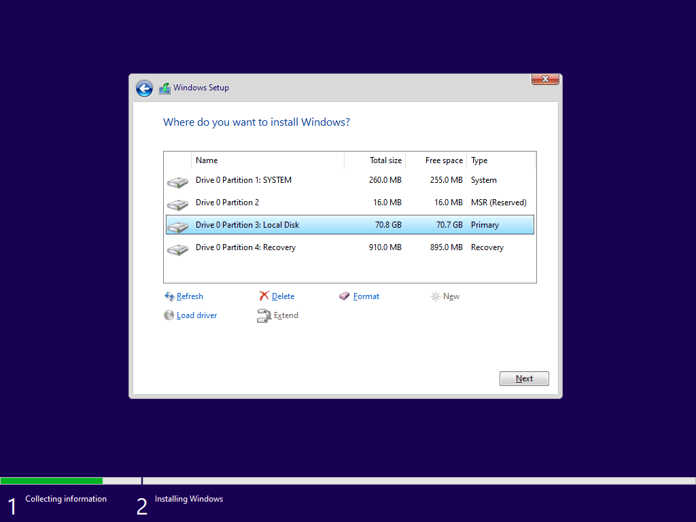

# Scripts

This directory contains all scripts that aid in provisioning Windows devices.
For more information on each set of scripts, each child directory has its own readme.

## Create Partitions

[`CreatePartitions-UEFI.txt`](CreatePartitions-UEFI.txt) configures the local disk for Windows installation.
The local disk, `Disk 0`, will be wiped during this process.
*Remove any extra drives and ensure your data is backed up before proceeding, we are not responsible for lost data.*

> [!IMPORTANT]  
> For legacy [BIOS–based devices](https://learn.microsoft.com/windows-hardware/manufacture/desktop/configure-biosmbr-based-hard-drive-partitions), use [`CreatePartitions-BIOS.txt`](CreatePartitions-BIOS.txt).



1. Select <kbd>Shift</kbd> + <kbd>F10</kbd> to open Command Prompt.
2. Execute the script through DiskPart, and provide the location of the script (e.g., USB flash drive).

   ```shell
   DiskPart /s D:\CreatePartitions-UEFI.txt
   ```

3. Select **Local Disk** and then select **Next**.

For more information, see [To partition hard drives and prepare to apply images](https://learn.microsoft.com/windows-hardware/manufacture/desktop/configure-uefigpt-based-hard-drive-partitions#to-partition-hard-drives-and-prepare-to-apply-images).

## Windows Setup Edition Configuration

The [`EI.cfg`](EI.cfg) configuration file ensures that Windows Setup always asks which Windows edition to install.

> [!NOTE]  
> This file is configured for the "Retail" channel.
> For OEM installations, change to "OEM".

1. Copy the [`EI.cfg`](EI.cfg) configuration file into the `\sources` directory on the Windows installation media.
2. When using the installation media, Windows Setup will always ask what Windows edition (e.g., Home or Pro) to install.

For more information, see [Windows Setup Edition Configuration and Product ID Files](https://learn.microsoft.com/windows-hardware/manufacture/desktop/windows-setup-edition-configuration-and-product-id-files--eicfg-and-pidtxt).